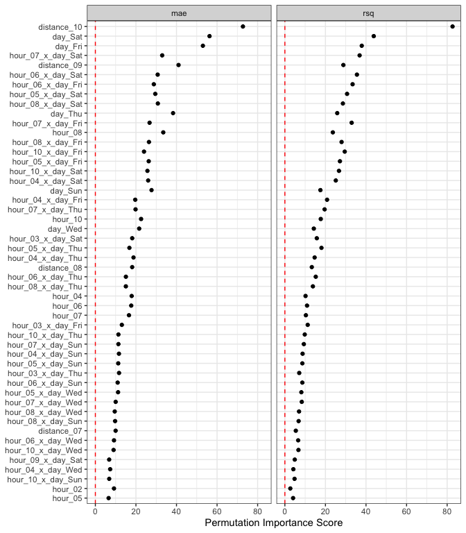

<!-- README.md is generated from README.Rmd. Please edit that file -->

# important

<!-- badges: start -->
<!-- badges: end -->

The goal of important is to …

## Installation

You can install the development version of important from
[GitHub](https://github.com/) with:

``` r
# install.packages("devtools")
devtools::install_github("topepo/important")
```

## Example

``` r
data(deliveries, package = "modeldata")

set.seed(991)
delivery_split <- initial_validation_split(deliveries, prop = c(0.6, 0.2), strata = time_to_delivery)
delivery_train <- training(delivery_split)
```

``` r
delivery_rec <- 
  recipe(time_to_delivery ~ ., data = delivery_train) %>% 
  step_dummy(all_factor_predictors()) %>% 
  step_zv(all_predictors()) %>% 
  step_spline_natural(hour, distance, deg_free = 10) %>% 
  step_interact(~ starts_with("hour_"):starts_with("day_"))

lm_wflow <- workflow(delivery_rec, linear_reg())
lm_fit <- fit(lm_wflow, delivery_train)
```

``` r
set.seed(382)
lm_deriv_imp <- 
  importance_perm(
    lm_fit,
    data = delivery_train,
    metrics = metric_set(mae, rsq),
    times = 50,
    type = "derived"
  )
lm_deriv_imp
#> # A tibble: 226 × 6
#>    .metric predictor             n  mean std_err importance
#>    <chr>   <chr>             <int> <dbl>   <dbl>      <dbl>
#>  1 rsq     distance_10          50 0.531 0.00642       82.7
#>  2 mae     distance_10          50 2.24  0.0308        72.8
#>  3 mae     day_Sat              50 1.09  0.0194        56.3
#>  4 mae     day_Fri              50 0.904 0.0171        53.0
#>  5 rsq     day_Sat              50 0.120 0.00274       43.8
#>  6 mae     distance_09          50 0.783 0.0191        41.0
#>  7 mae     day_Thu              50 0.633 0.0165        38.3
#>  8 rsq     day_Fri              50 0.101 0.00265       37.9
#>  9 rsq     hour_07_x_day_Sat    50 0.140 0.00380       36.8
#> 10 rsq     hour_06_x_day_Sat    50 0.143 0.00403       35.5
#> # ℹ 216 more rows
```

``` r
autoplot(lm_deriv_imp, top = 100)
```



``` r
set.seed(382)
lm_orig_imp <- 
  importance_perm(
    lm_fit,
    data = delivery_train,
    metrics = metric_set(mae, rsq),
    times = 50
  )
lm_orig_imp
#> # A tibble: 60 × 6
#>    .metric predictor     n   mean std_err importance
#>    <chr>   <chr>     <int>  <dbl>   <dbl>      <dbl>
#>  1 rsq     hour         50 0.780  0.00423     184.  
#>  2 mae     hour         50 4.07   0.0332      123.  
#>  3 mae     day          50 1.91   0.0250       76.4 
#>  4 mae     distance     50 1.49   0.0209       71.2 
#>  5 rsq     distance     50 0.289  0.00450      64.3 
#>  6 rsq     day          50 0.325  0.00516      63.0 
#>  7 mae     item_24      50 0.0587 0.0149        3.93
#>  8 mae     item_03      50 0.0446 0.0146        3.06
#>  9 mae     item_10      50 0.0457 0.0152        3.00
#> 10 mae     item_02      50 0.0398 0.0146        2.72
#> # ℹ 50 more rows
```

``` r
autoplot(lm_orig_imp)
```


## Code of Conduct

Please note that the important project is released with a [Contributor
Code of
Conduct](https://contributor-covenant.org/version/2/1/CODE_OF_CONDUCT.html).
By contributing to this project, you agree to abide by its terms.
